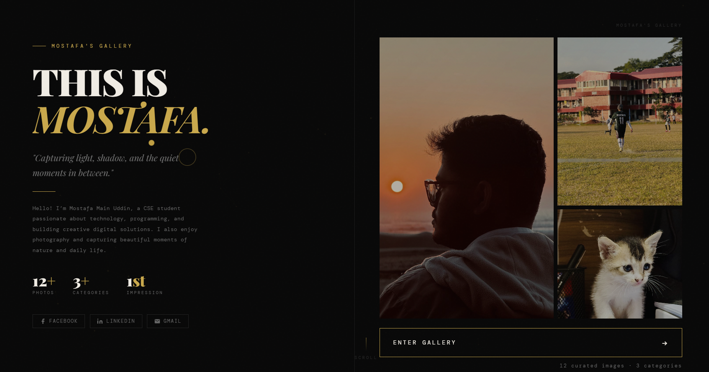
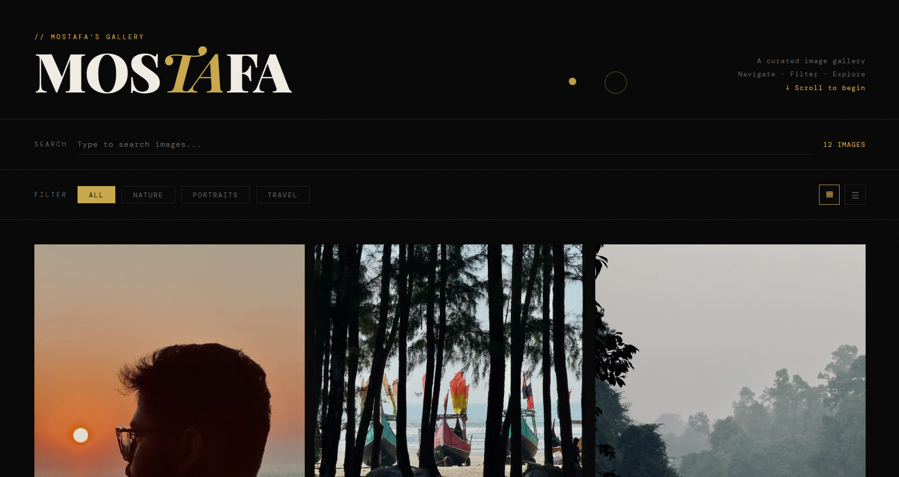
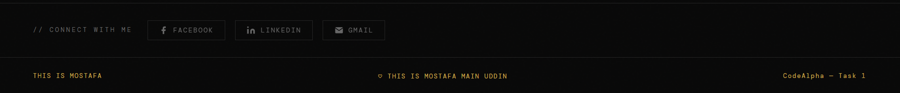

# 📸 Mostafa's Gallery

A modern and responsive **image gallery website** created to showcase personal photography in a clean, elegant, and minimal design. The project highlights smooth navigation, a welcoming introduction section, and a responsive gallery layout.

🔗 **Live Demo:**
https://mostafasgallery.netlify.app/

---

# 📖 About The Project

**Mostafa's Gallery** is a personal portfolio-style gallery website built to display images in an organized and visually appealing layout.

The project focuses on:

* Clean UI design
* Smooth user experience
* Responsive layout
* Simple and elegant gallery presentation

It was created as part of learning and practicing **front-end web development** concepts.

---

# ✨ Key Features

✅ Smooth scrolling interface
✅ Responsive image gallery layout
✅ Minimal and modern design
✅ Personal introduction section
✅ Fast loading static website
✅ Use PC for better view.

---

# 🖼️ Website Preview





---

# 🛠️ Technologies Used

This project was built using the following technologies:

* **HTML5** – Structure of the website
* **CSS3** – Styling and layout design
* **JavaScript** – Interactivity and smooth scrolling
* **Netlify** – Website deployment

---

# 📂 Project Structure

```
MostafasGallery
│
├── index.html
├── style.css
├── script.js
├── preview.png
└── images/
```

# 🌐 Deployment

This project is deployed using **Netlify** for fast and reliable hosting.

Whenever the repository is updated, the site can be redeployed easily using Netlify.

Live Site:
https://mostafasgallery.netlify.app/

---

# 🎯 Purpose of the Project

The main goal of this project was to practice:

* Frontend website design
* Responsive layouts
* Image gallery UI
* Smooth user interaction
* Deploying a website online

---

# 📌 Future Improvements

Some improvements planned for future versions:

* 🔍 Image lightbox preview
* 🗂 Image filtering by category
* 🎞 Smooth animation effects
* ☁ Dynamic image upload system
* 📱 Enhanced mobile optimization

---

# 👨‍💻 Author

**Mostafa Main Uddin**

🎓 CSE Student
💻 Aspiring Software Developer

---

# ⭐ Support

If you like this project, consider giving it a **⭐ star on GitHub**.
It helps support the project and motivates further development.

---
